# Architecture: what calls what

Flow charts are [Mermaid](https://mermaid.js.org/) diagrams (rendered by GitHub; any Mermaid viewer works). Box text is
`file::function_or_class`. Arrows mean "calls / hands data to". Start with section 1 to find your scenario, then follow
the chart of the phase you care about.

Contents: 1 [Scenario map](#1-scenario-map) · 2 [Config resolution](#2-config-resolution) · 3 [Training](#3-training-flow) ·
4 [One training iteration](#4-one-training-iteration) · 5 [Model forward](#5-model-hierarchy-and-forward-pass) ·
6 [Validation](#6-validation) · 7 [Inference / sampling](#7-inference-and-sampling) ·
8 [Patch aggregation](#8-patch-aggregation-weatherdiff-style) · 9 [Evaluation](#9-evaluation) ·
10 [Image pipeline](#10-image-pipeline-upstream-still-available) · 11 [Scenario differences](#11-what-each-scenario-changes) ·
12 [File hierarchy](#12-file-hierarchy) · 13 [Tensor layouts](#13-tensor-layouts-cheat-sheet)

---

## 1. Scenario map
Everything starts either from `scripts/run_scenario.sh` (a thin wrapper) or directly from one of four entrypoints.
A *scenario* is just a config (`_base_` inheritance) plus the entrypoint that consumes it.

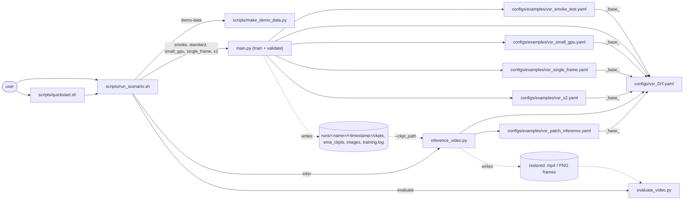

| Scenario | Command (`scripts/run_scenario.sh ...`) | Entrypoint | Config |
|---|---|---|---|
| Smoke test | `smoke` | `main.py` | `configs/examples/vsr_smoke_test.yaml` |
| Standard 4x video SR | `standard` | `main.py` | `configs/vsr_DiT.yaml` |
| Small GPU | `small_gpu` | `main.py` | `configs/examples/vsr_small_gpu.yaml` |
| Single frames (T=1) | `single_frame` | `main.py` | `configs/examples/vsr_single_frame.yaml` |
| 2x upscaling | `x2` | `main.py` | `configs/examples/vsr_x2.yaml` |
| Resume / fine-tune | `<scenario> --resume F` / `--init F` | `main.py` | same as the scenario |
| Inference (tiled) | `infer ...` | `inference_video.py` | training config of the checkpoint |
| Inference (patch aggregation) | `infer ... --patch` | `inference_video.py` | + `patch_restoration.enabled` |
| Evaluation | `evaluate ...` | `evaluate_video.py` | – |
| Image SR (upstream) | – | `main.py` / `inference.py` | `configs/realsr_*.yaml`, `configs/faceir_DiT.yaml` |

## 2. Config resolution
Done at the start of every entrypoint. This is where a scenario's overrides and the crop-dependent values are fixed.

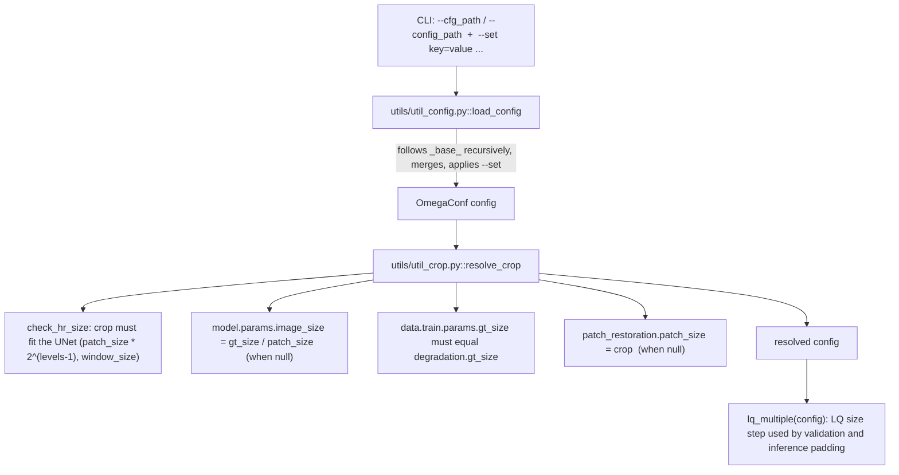

## 3. Training flow
`python main.py --cfg_path <config>` (or `torchrun ... main.py` for several GPUs).

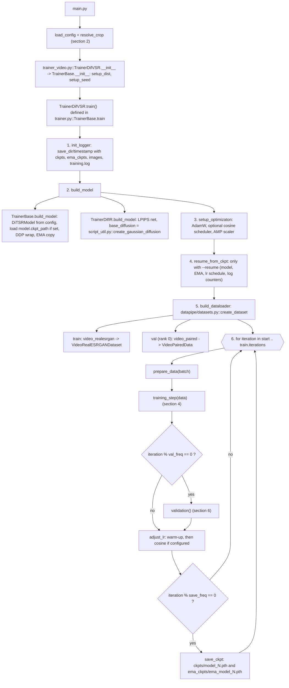

**Datasets in detail**

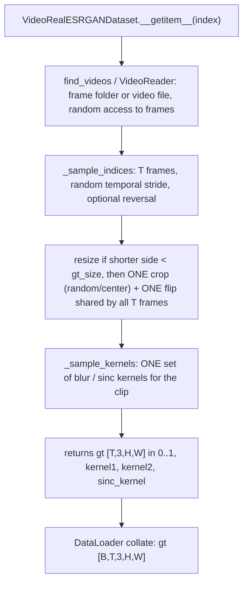
The degraded LQ clip is **not** made in the dataset: it is made on the GPU in `prepare_data` (next section).

## 4. One training iteration

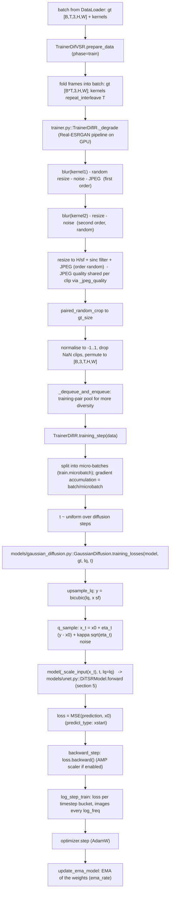

## 5. Model hierarchy and forward pass
`models/unet.py::DiTSRModel` takes an image `[B,3,H,W]` or a clip `[B,3,T,H,W]`.

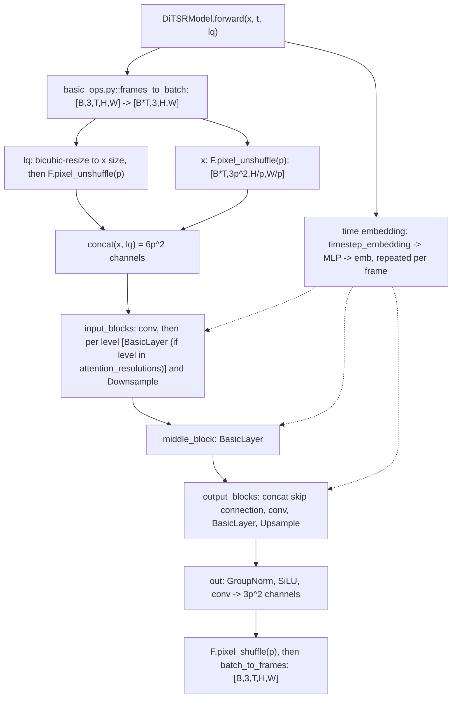

**Inside one `BasicLayer`** (`models/swin_transformer.py`), repeated `swin_depth` times, each block a `SwinTransformerBlock_AdaLNZero`:

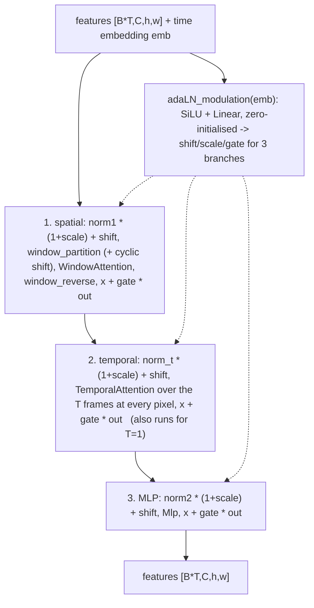
Because every gate starts at 0, a fresh model is an identity map in all three branches (adaLN-Zero); temporal attention is
the only place frames interact (convs, window attention and MLP see frames independently).

## 6. Validation
Runs inside training (`val_freq`) on rank 0, using EMA weights when `train.use_ema_val`.

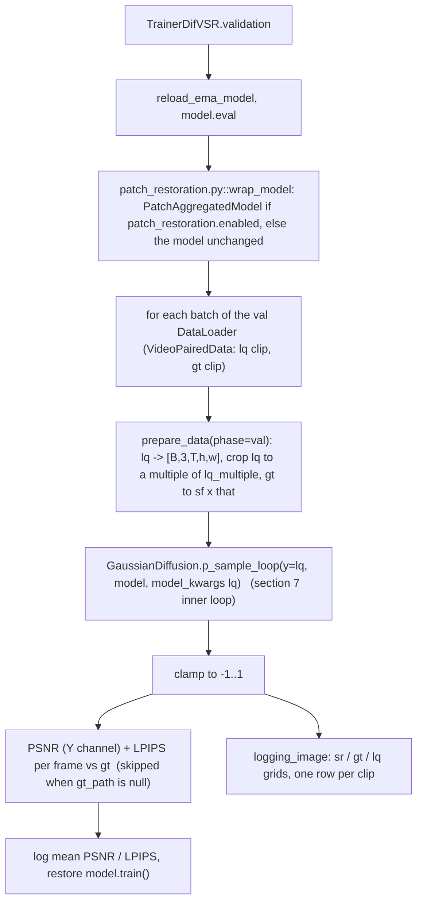

## 7. Inference and sampling
`python inference_video.py -i <video> --config_path <cfg> --ckpt_path <ckpt>`

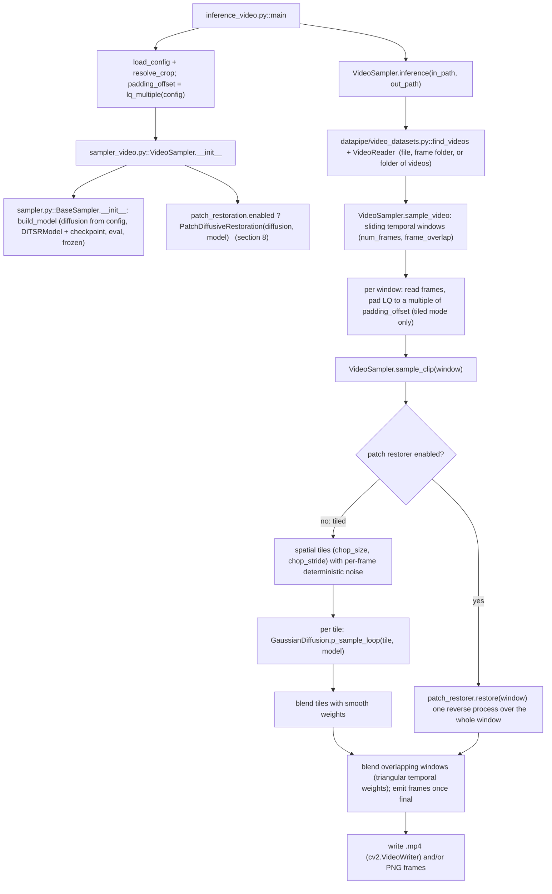

**The diffusion sampling loop** (identical for validation, tiles and patches; `models/gaussian_diffusion.py`):

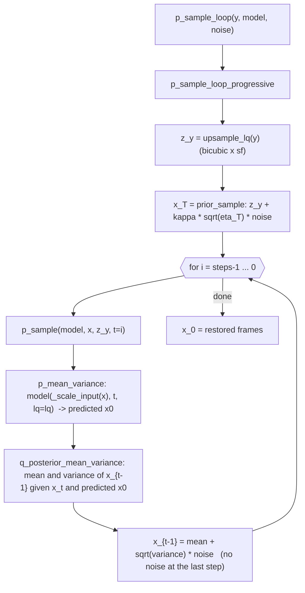
`model` here is either the plain `DiTSRModel` or the `PatchAggregatedModel` wrapper; the loop does not know the difference.

## 8. Patch aggregation (WeatherDiff-style)
Optional, off by default (`patch_restoration.enabled`). Idea from [WeatherDiffusion](https://github.com/IGITUGraz/WeatherDiffusion):
instead of restoring tiles independently, aggregate overlapping patch predictions at **every** reverse step.

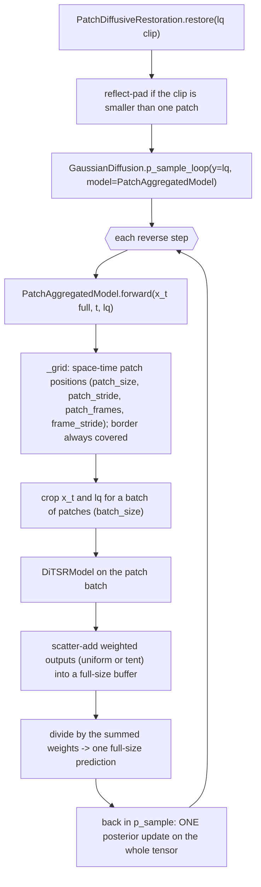

## 9. Evaluation
`python evaluate_video.py -i <restored> -r <ground truth>`

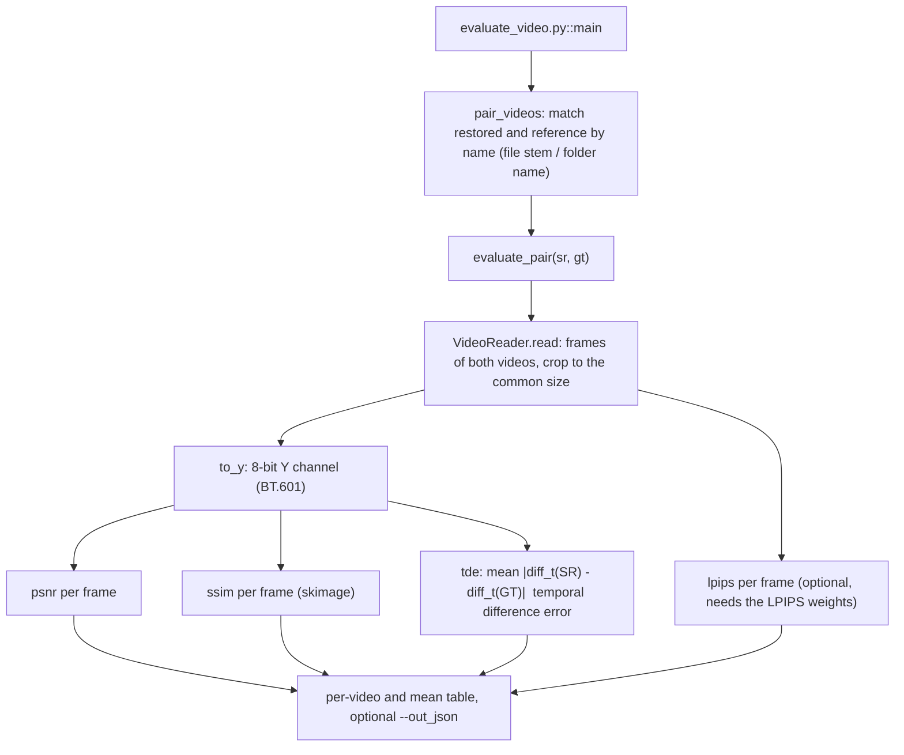

## 10. Image pipeline (upstream, still available)
Same trainer/diffusion/model code, single images, no video classes.

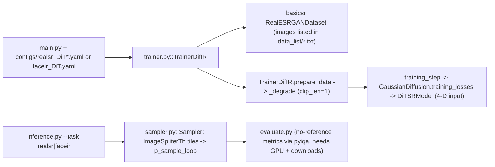

## 11. What each scenario changes
All rows inherit `configs/vsr_DiT.yaml`; only the listed keys differ. The code path is the same in every scenario.

| Scenario | Changed config keys | Effect on the flow charts |
|---|---|---|
| smoke | tiny model (`model_channels` 32, `swin_depth` 1), `steps: 3`, 20 iterations, `use_amp: False` | same flow, minutes instead of days |
| standard | – | 256 px crops, `num_frames: 5`, 56M parameters |
| small_gpu | `degradation.gt_size: 128`, `num_frames: 3`, smaller model, `attention_resolutions: [32,16,8]` | `resolve_crop` derives `image_size: 32`, patch size 128 |
| single_frame | `num_frames: 1`, `frame_stride: [1,1]` | datasets return `T=1` clips; temporal attention still runs on one frame |
| x2 | `degradation.sf: 2`, `diffusion.params.sf: 2` | `upsample_lq` scales x2; `lq_multiple` = 128 |
| patch inference | `patch_restoration.enabled: True` | `sample_clip` takes the right branch of section 7 and runs section 8 |
| resume | `--resume ckpt` | `resume_from_ckpt` (section 3) restores model, EMA, lr schedule, counters |
| fine-tune | `--set model.ckpt_path=...` | `TrainerBase.build_model` loads the weights into a new run |

## 12. File hierarchy

```
.
├── main.py                       training entrypoint -> trainer.target from the config
├── inference_video.py            video inference CLI -> VideoSampler
├── evaluate_video.py             video metrics CLI
├── inference.py / evaluate.py    upstream image inference / no-reference metrics
├── trainer_video.py              TrainerDifVSR   (video data prep, validation, logging)   extends:
├── trainer.py                    TrainerBase -> TrainerDifIR (degradation, training_step, EMA) [+ image variants]
├── sampler_video.py              VideoSampler    (windows x tiles, blending)              extends:
├── sampler.py                    BaseSampler (loads model + diffusion) -> Sampler (images)
├── patch_restoration.py          PatchAggregatedModel, PatchDiffusiveRestoration, wrap_model
├── configs/
│   ├── vsr_DiT.yaml              base video config (all keys documented)
│   ├── examples/                 scenario configs (use _base_)
│   └── realsr_*.yaml, faceir_*   upstream image configs
├── datapipe/
│   ├── datasets.py               create_dataset(type -> class)
│   └── video_datasets.py         VideoReader, find_videos, VideoRealESRGANDataset, VideoPairedData
├── models/
│   ├── unet.py                   DiTSRModel (5-D input, pixel-unshuffle)
│   ├── swin_transformer.py       BasicLayer, SwinTransformerBlock_AdaLNZero, WindowAttention, TemporalAttention
│   ├── basic_ops.py              frames_to_batch / batch_to_frames, timestep_embedding, norm, conv helpers
│   ├── gaussian_diffusion.py     GaussianDiffusion: q_sample, training_losses, p_sample_loop, upsample_lq
│   ├── script_util.py            create_gaussian_diffusion (config -> diffusion object)
│   └── respace.py, losses.py, resample.py, solvers.py, fp16_util.py, fan.py   support code
├── utils/
│   ├── util_config.py            load_config (_base_, --set)
│   ├── util_crop.py              resolve_crop, check_hr_size, lq_multiple
│   └── util_common.py, util_image.py, util_net.py, util_opts.py, util_sisr.py
├── scripts/                      run_scenario.sh, quickstart.sh, make_demo_data.py
├── basicsr/                      vendored BasicSR pieces (degradations, JPEG, filters, datasets)
├── ldm/                          leftover helper code (util.py, EMA); the autoencoder was removed
└── docs/ARCHITECTURE.md          this file
```

## 13. Tensor layouts cheat sheet

| Where | Layout | Range |
|---|---|---|
| Dataset output `gt` | `[T,3,H,W]` (batch: `[B,T,3,H,W]`) | 0..1 |
| After `prepare_data` / model interface | `[B,3,T,H,W]`; LQ `[B,3,T,H/sf,W/sf]` | -1..1 |
| Inside the model | `[B*T,C,h,w]` (frames folded into the batch) | – |
| After pixel-unshuffle | `[B*T,3p^2,H/p,W/p]`, `p = model.patch_size` | – |
| Diffusion state `x_t`, `x_0` | `[B,3,T,H,W]` (pixel space) | about -1..1 |
| Evaluation | Y channel, 8-bit, per frame | 16..235 |
